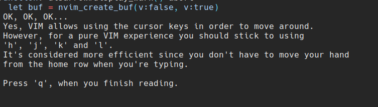

# disarrow.vim
This plugin disable arrow keys and correct to use 'h', 'j', 'k', and 'l'.

And display warning like this screenshot when you use arrow keys.

This message is inspired by [VIM Adventures](https://vim-adventures.com/)

**Note**

<font color="red">**This plugin force disable arrow keys.**</font>
Be careful.


## Requirements
neovim +0.4.0. (This plugin use floating window)


## Install

dein.vim

```toml
[[plugins]]
repo = 'Inazuma110/disarrow.vim'
```

## Configuration
If you want to use japanese, set this.
```vim
let g:disarrow#lang = 'ja'
```
